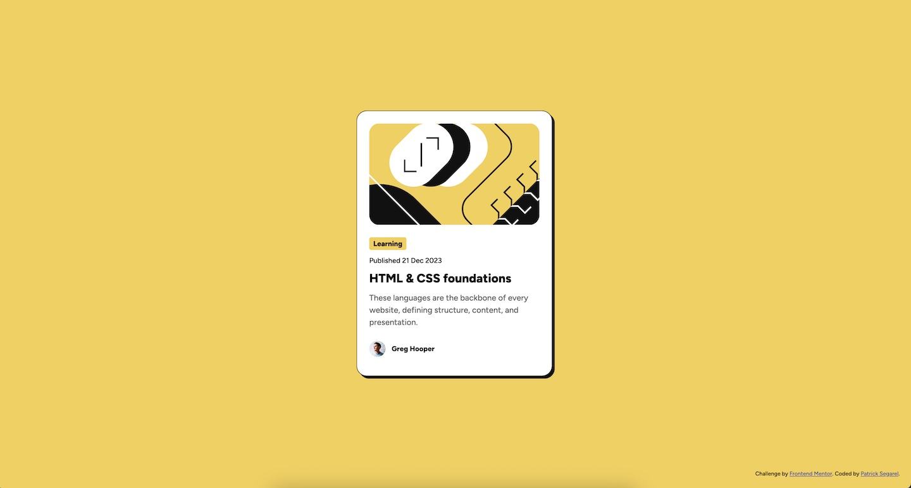

# Frontend Mentor - Blog preview card solution

This is a solution to the [Blog preview card challenge on Frontend Mentor](https://www.frontendmentor.io/challenges/blog-preview-card-ckPaj01IcS). Frontend Mentor challenges help you improve your coding skills by building realistic projects.

## Table of contents

- [Overview](#overview)
  - [The challenge](#the-challenge)
  - [Screenshot](#screenshot)
  - [Links](#links)
- [My process](#my-process)
  - [Built with](#built-with)
  - [What I learned](#what-i-learned)
  - [Useful resources](#useful-resources)
- [Author](#author)

## Overview

### The challenge

Your challenge is to build out this blog preview card and get it looking as close to the design as possible.

You can use any tools you like to help you complete the challenge. So if you've got something you'd like to practice, feel free to give it a go.

Your users should be able to:

- See hover and focus states for all interactive elements on the page

### Screenshot

### Links

- Solution URL: [Add solution URL here](https://github.com/psegarel/fem-blog-preview-card)
- Live Site URL: [Add live site URL here](https://psegarel.github.io/fem-blog-preview-card/)

## My process

### Built with

- Semantic HTML5 markup
- CSS custom properties

### What I learned

A nice CSS refresher as well as a good intro to working with Figma.

### Useful resources

- [Trae AI IDE](https://www.trae.ai/) - Trae is an adaptive AI IDE that transforms how you work, a nice alternative to MDN.

## Author

- Website - [Patrick Segarel](https://www.patrick-segarel.com)
- Frontend Mentor - [@yourusername](https://www.frontendmentor.io/profile/psegarel)
